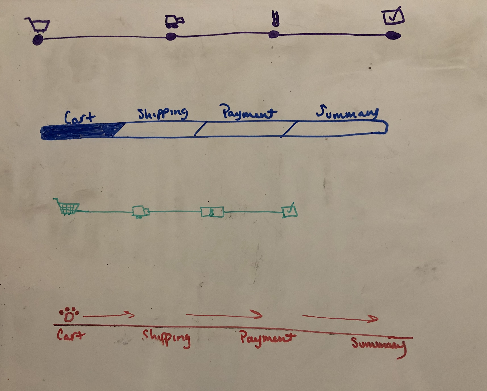
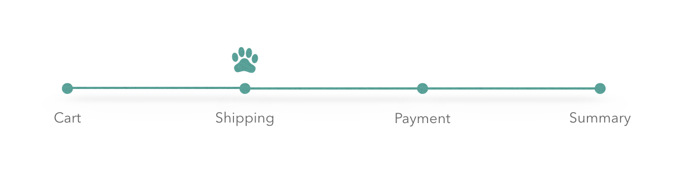

# General Animals
Implement progress bar into checkout process

### Technologies
- HTML
- JavaScript
- SASS/SCSS
- GSAP

### Installation
```git clone git@github.com:lisaolson/general-animals.git```

```npm install```

### Process
- Research designs and implementations of successful/well-known progress bars including relevant company sites such as Petco and Petsmart
- Write out users' intentions, expectations and goals
- Brainstorm multiple versions of the progress bar
- Whiteboard initial wireframes of progress bar
- Keynote creation of progress bar based on wireframes
- Implement design in actual code
- Make adjustments as needed

#### User Statements
- I want to know where I'm at in the order process
- I want to easily move back and forth between order stages
- I want to be clear where I was, where I am, and my future steps, if any

#### Reasoning
##### Color choice
- Based on Petsmart, Wag!, Rover, and Petco
- <Blue/Red/Green> deriving feelings of safety, trust and loyalty
##### Tools
- Keynote made the most sense seeing as it was a simple, one-component design as opposed to an entire webpage/mobile design
- SASS is a library I'm familiar with and makes life easy when it comes to styling
- GSAP was brand new to me, but I quickly saw the benefits of using it over regular CSS Animations and thoroughly enjoyed incorporating it into the progress bar
##### Design
- The design makes it clear where the user is in the order process while maintaining consistency with an animal-focused company 
- After research on common progress bars in most current websites, it seems the trend is to place the progress bar in the upper quadrant of the website where it's unobtrusive, yet visible. This is generally paired with a summary box on the right hand side shwoing exactly what is being purchased and the total costs. 
- Animations and interactivity are what make navigating websites so enjoyable so I tried to include both of those.
- It's responsive and should work on all screen sizes and browsers
##### Layout
- It seems most effective progress bars stay in the same place throughout the entire checkout process.
- It's beneificial to have it at the top of the screen so that it's clearly in view and there's no need to scroll to be able to see it
##### File Structure
- I chose not to separate scss, css, and js files into directories as it was such small components and pieces of code, it didn't seem logical to create folders for each one.

#### Bonus
- SASS/SCSS - I have used SASS previously in projects.
- GSAP - Brand new to me, but loved diving into the documentation and learning how to incoporate it.

#### Future
- This could be improved through testing different sizes, colors and placements against users' purchases and providing surveys on overall satisfaction with checkout process with/without the progress bar.

##### Images
Below contain my initial drawings of possible progress bar designs, my keynote graphic of the bar and a gif of the final working product



### Author
Lisa Olson | @eunoia_lo
