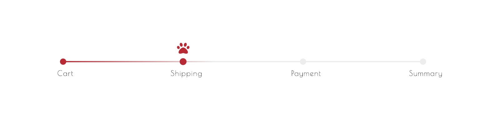

# General Animals Task
Implement progress bar into checkout process

### Technologies
- HTML
- JavaScript
- SASS/SCSS
- GSAP

### Installation
```git clone git@github.com:lisaolson/general-animals.git```

```npm install```

#### Linux
```xdg-open index.html```

##### Mac OS
```open index.html```

#### Windows
```download```

```extract```

```click index.html```

### Process
- Research designs and implementations of successful/well-known progress bars including relevant company sites such as Petco and Petsmart
- Write out users' intentions, expectations and goals
- Brainstorm multiple versions of the progress bar
- Whiteboard initial wireframes of progress bar
- Keynote creation of progress bar based on wireframes
- Implement design into actual code
- Make adjustments as needed

### User Statements
- I want to know where I'm at in the order process
- I want to easily move back and forth between order stages
- I want to be clear where I was, where I am, and my future steps, if any

### Reasoning
##### Color choice
- Based on Petsmart, Wag!, Rover, and Petco
- <Red/Gray> deriving feelings of awareness, importance, attention-drawing, professionalism, indicator to be aware
##### Tools
- Keynote made the most sense seeing as it was a simple, one-component design as opposed to an entire webpage/mobile design
- SASS is a library I'm familiar with and makes life easy when it comes to styling
- GSAP was brand new to me, but I quickly saw the benefits of using it over regular CSS Animations and thoroughly enjoyed incorporating it into the progress bar
##### Design
- The design makes it clear where the user is in the order process while maintaining consistency with an animal-focused company 
- After research on common progress bars in most current websites, it seems the trend is to place the progress bar in the upper quadrant of the website where it's unobtrusive, yet visible. This is generally paired with a summary box on the right hand side showing exactly what is being purchased and the total costs. 
- Animations and interactivity are what make navigating websites so enjoyable so I tried to include both of those.
- It's responsive and should work on all screen sizes and browsers
##### Layout
- It seems most effective progress bars stay in the same place throughout the entire checkout process.
- It's beneificial to have it at the top of the screen so that it's clearly in view and there's no need to scroll to be able to see it
##### File Structure
- Folder for SASS, CSS, and JS.  This could be separated further by stylesheets folder and images folder all residing in a public folder.  
##### Accessibility
- The a tags should cover the case someone is using the bar without a mouse to navigate through the checkout process
##### Responsive
- The progress bar should be fully responsive.  I only did a breakpoint for phone and small tablet screens as it seemed to respond well at widths above that breakpoint.
##### Note
- I chose not to include side arrows (left and right) as this seems to be more industry-standard. 

#### Bonus
- SASS/SCSS - I have used SASS previously in projects.
- GSAP - Brand new to me, but loved diving into the documentation and learning how to incoporate it.

#### Future
- This could be improved through testing different sizes, colors and placements against users' purchases and providing surveys on overall satisfaction with checkout process with/without the progress bar.

##### Images
Below contain my initial drawings of possible progress bar designs, my keynote graphic of the bar, and a final screenshot of the working product




### Author
Lisa Olson | @eunoia_lo
